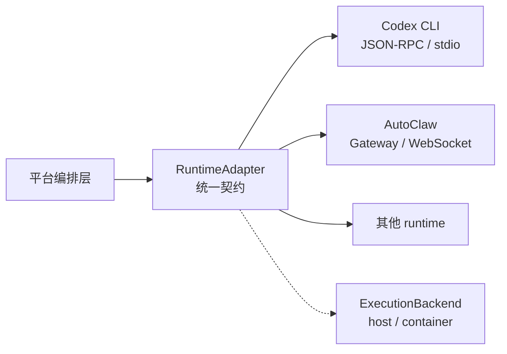

# niuma-core

> 把形态各异的 AI Agent CLI，统一成可被平台编排的执行后端。

[](LICENSE)
[](https://www.typescriptlang.org/)
[](https://nodejs.org/)
[](#运行测试)

*Runtime abstraction layer that unifies heterogeneous AI agent CLIs (Claude Code, Codex, AutoClaw) behind a single orchestration contract. Extracted from NiuMa, an AI-employee platform.*

`niuma-core` 是 AI员工平台 NiuMa 的运行时内核层，解决一个具体问题：Claude Code、Codex CLI、AutoClaw 这类 agent runtime 各有各的进程模型、传输协议和会话语义，平台一旦直接耦合其中任何一个，就会被它锁死。

这里抽出的是平台与 runtime 之间的那层契约——**适配器抽象、执行后端模型、JSON-RPC over stdio 传输，以及跨端通信的协议定义**。

## 为什么需要这一层

agent runtime 至少在四个维度上互不相同：

| 维度 | 差异 |
| --- | --- |
| 进程模型 | 一次性命令 · 常驻进程 · 远程 gateway |
| 传输 | stdout 文本流 · JSON-RPC over stdio · WebSocket |
| 会话 | 无状态 · 本地 session 文件 · 服务端托管会话 |
| 中断语义 | 信号终止 · 协议级 cancel · 不支持 |

平台需要的却是统一的东西：发起一轮执行、拿到流式输出、能中断、能恢复上下文、能知道它是否还活着。



## 核心设计

**两种适配器，而不是一种。** 一次性命令和常驻进程的差别无法被同一个接口优雅覆盖，强行统一只会让所有实现都退化到最小公分母：

```ts
import { isPersistentRuntimeAdapter } from "@niuma/agent-runtime-core";

// 一次性：跑完即结束
interface RuntimeAdapter {
  readonly runtime: RuntimeId;
  run(input: RuntimeRunInput): Promise<RuntimeRunResult>;
}

// 常驻：start 一次，prompt 多次，显式销毁
interface PersistentRuntimeAdapter {
  readonly runtime: RuntimeId;
  readonly alive: boolean;
  start(input: RuntimeStartInput): Promise<void>;
  prompt(input: RuntimePromptInput): Promise<RuntimeRunResult>;
  destroy(reason?: string): Promise<void> | void;
}

// 调用方按能力分支，而不是假设所有 runtime 一样
if (isPersistentRuntimeAdapter(adapter)) {
  await adapter.start({ agentId, cwd, systemPrompt });
  const r1 = await adapter.prompt({ prompt: "分析这个仓库" });
  const r2 = await adapter.prompt({ prompt: "基于上面的结论写测试" }); // 复用上下文
  await adapter.destroy("task done");
} else {
  await adapter.run({ agentId, cwd, prompt, systemPrompt });
}
```

**执行后端与适配器正交。** 同一个 Codex adapter 既能跑在宿主机，也能跑在 per-employee 容器里——`ExecutionBackend` 负责「在哪跑」，`RuntimeAdapter` 负责「怎么说话」，两者不交叉。

**权限请求是回调，不是异常。** `requestPermission` 让 runtime 在需要授权时把决定权交回平台，由人类在 Inbox 审批后继续执行，而不是直接失败。

**传输层可独立测试。** `json-rpc-stdio-client.ts` 不知道 agent 的存在，只做 stdio 上的 JSON-RPC 帧解析和请求-响应配对。

**协议是单一事实来源。** `shared/protocol.ts` 被 server、web、daemon、mobile 共同引用，配合 `protocol-contract.ts` 的运行时校验，避免各端对同一字段有不同理解。

## 目录结构

```
packages/
  agent-runtime-core/          runtime 适配层
    adapter.ts                   RuntimeAdapter / PersistentRuntimeAdapter
    execution-backend.ts         执行后端模型（host / container）
    json-rpc-stdio-client.ts     JSON-RPC over stdio 传输
    codex-adapter.ts             Codex CLI 适配实现
    autoclaw-adapter.ts          AutoClaw 适配实现（经 Gateway）
  shared/                      跨端共享协议
    protocol.ts                  平台 wire protocol 定义
    protocol-contract.ts         契约运行时校验
    runtime-session-scope.ts     会话作用域模型
```

## 设计文档

`docs/specs/` 是做这些决策时的实际分析记录，不是事后补写的说明：

- [daemon 架构选型对比](docs/specs/2026-05-14-wm-vs-slock-daemon-comparison.md) — 两种 daemon 架构的取舍
- [adapter 层可行性分析](docs/specs/2026-05-15-slock-agent-adapter-analysis.md) — 抽象边界怎么划
- [agent 例行任务代理模型](docs/specs/2026-05-25-agent-routine-proxy.md)
- [agent 能力的阶段划分](docs/specs/2026-05-25-third-stage-agent.md)
- [runtime 鉴权检测矩阵](docs/specs/2026-06-11-runtime-auth-detection-matrix.md) — 各 runtime 登录态怎么探测

## 运行测试

```bash
pnpm install
pnpm --filter @niuma/agent-runtime-core test
pnpm --filter @niuma/shared test
```

## 更多

架构设计、决策记录与工程实践：**[omiyeong.github.io](https://omiyeong.github.io)**

## 项目状态

这是 NiuMa 平台的内核抽取，**不是可独立运行的完整系统**。完整平台包含 Workspace Server、WM Daemon、Web 与 Mobile 端，约 14 万行 TypeScript，暂未开源。

本仓库的价值在于展示 runtime 抽象层的设计与协议契约，可直接阅读和单测，不依赖平台其余部分。

## License

[MIT](LICENSE)
